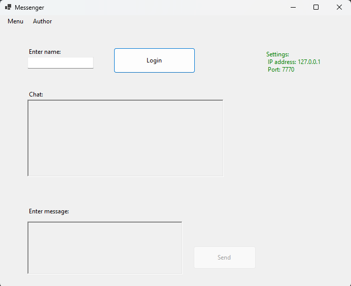
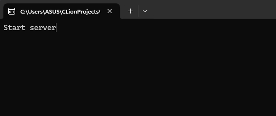
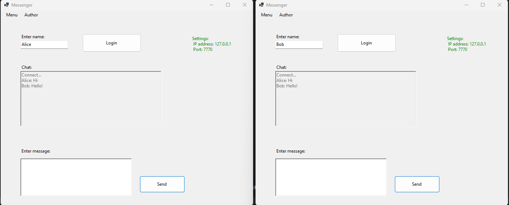

# Application for chatting    
Данное приложение предназначено для общения внутри локальной сети. Оно создано для общения между двумя или несколькми людьми в случае одного чата. Может пригодиться для домашнего пользования, офиса и прочих организаций. 
## Содержание 
- Описание 
- Функции 
- Примеры использования
- Установка
- Авторы
## Описание 
Приложение предоставляет возможность общаться между людьми внутри локальной сети. Благодаря графичекому интерфейсу пользователям будет легко понять принцип работы чата.
При входе в приложение у пользователя на рабочем столе появится окно. Для того чтобы обмениваться сообщениями с другими людьми, ему необходимо зайти в "Menu" далее "Settings" и выставить ip адрес сервера и порт. После чего пользователь должен сохранить настройки. 
Тоже самое должен сделать и его собеседник(-и). После чего им необходимо ввести никнейм и нажать кнопку "login". После этих действий они могут свободно переписываться в чате. 
## Функции 
Данное приложение находится на бета версии. К возможностям пользователя пока можно отнести передачу текстовых сообщений. 
## Примеры использования
В качестве примера можно показать, как именно работает чат на иллюстрациях. 
Для начала окно приложения выглядит следующим образом: 

В главном окне приложения видим иконы "Menu", "Author". Что немало важно виден пункт "Enter name". 
Попробуем войти под своим ником и проверить работу чата открыв дургой и запустив сервер.
Сперва запуск сервера:

Далее открываем второем окно, логинемся на обоих и проверяем работоспособность:

## Установка 
Для того чтобы установить данное приложение, нужно следовать инструкции, представленной ниже:
- Клонировать репозиторий, используя команду: git clone https://github.com/stwm27/Something-in-the-way.git;
- Убедиться что зависимости установлены. Проверьте установлен ли у вас компилятор для C++;
- Откройте терминал, а также файл Compilire.txt. Внутри этого файла будет строка для компиляции сервера;
- Скомпилируйте директорию "MyClient";
- Запустите проект "MyClient".
## Авторы 
- [Alen Yeskulov](https://github.com/stwm27)

